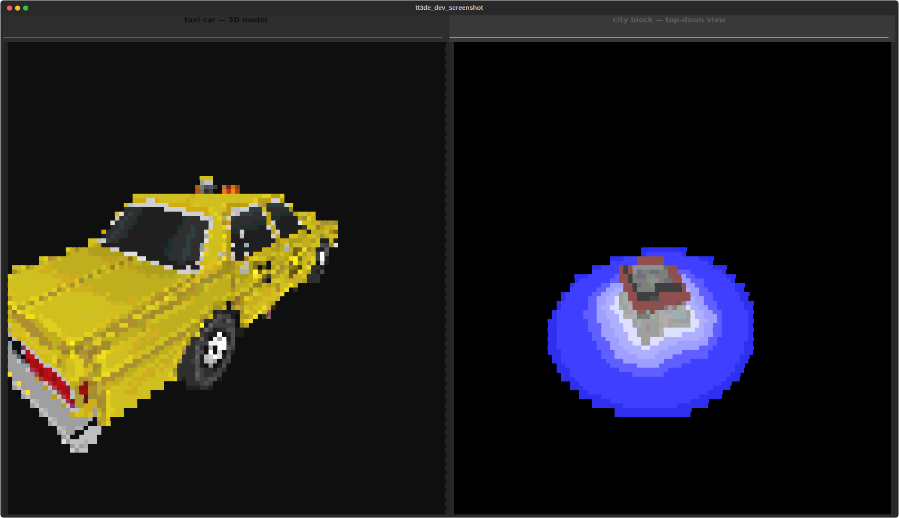

# TinyTiny 3D Engine

A minimalistic 2D/3D engine implemented in Rust and bound to Python, designed to render 3D objects using ASCII art.

<p align="center">
  
</p>

## Features

* **Rendering Primitives**: Supports points, lines, and triangles in both 2D and 3D contexts.
* **ASCII Output**: Renders 3D scenes in a charming ASCII art style.
* **Color Shading Support**: Renders with RGB colors.
* **Materials**: Supports 14 materials, including:
    * **Texture Mapping**: Supports textures up to 256x256 pixels.
    * **Double Raster**: Allows the use of 2 colors per ASCII character (background and foreground).
    * **Perlin Noise**: Basic Perlin noise mapped texture.


## Recommended Terminals :

| Terminal              | Windows                      | macOS                | Linux                |
|-----------------------|------------------------------|----------------------|----------------------|
| [wez Terminal](https://wezterm.org/)          | :star: Fastest rendering accross all terms          |                      |                      |
| [tabby](https://tabby.sh/) | :star: Runs ok, struggle at big resolutions |                      |                      |
| default Windows Terminal | :x: Can't keep up with the rendering |                      |                      |
| VScode terminal       | :x: Does not even works | :x: Can't keep up with rendering | :x:                   |
| [gostty](https://ghostty.org/)                |                               | :star: Perfect! | :star: Perfect, assuming you have your graphics drivers installed |
| [kitty](https://sw.kovidgoyal.net/kitty/)                 |                              | Almost perfect, start to slow down at HighRes | untested       |
| iTerm/iTerm2          |                              | Won't keep up with high refresh rate (>10fps) |                   |


## Setting Up the Development Version

To set up a development version of this engine:

1. Clone this repository:
    ```bash
    git clone <repo_url>
    ```
2. Install uv (if needed):
    ```bash
    pip install uv
    ```
3. Create the environment and install project + dev dependencies:
    ```bash
    uv sync --group dev
    ```
4. Compile the Rust version locally:

    ```bash
    uv run maturin develop --profile release
    ```
5. Check the demo:
    ```bash
    PYTHONPATH=python uv run python demos/3d/some_models.py
    ```

6. Run the Rust unit tests:
    ```bash
    cargo test
    ```
7. Run the Python unit tests:
    ```bash
    uv run pytest
    ```
8. Regenerate TTSL opcode/ABI files after opcode definition changes:
    ```bash
    uv run tt3de-gen-opcodes
    ```


### Tips for Python Path in VSCode

Due to the mix of Python and Rust in this project, the Python code is located in the `python` folder. More information can be found [here](https://www.maturin.rs/project_layout#mixed-rustpython-project).

In `launch.json` for VSCode:

```json
"env": {"PYTHONPATH": "${workspaceFolder}/python"}
```

In `settings.json`:

```json
{
    "python.analysis.extraPaths": [
        "python"
    ]
}
```

### Known Issues

* Many...
