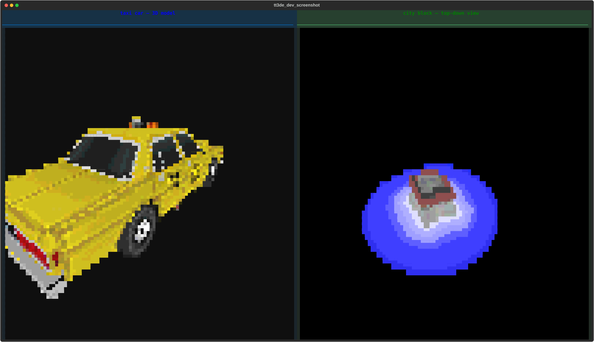
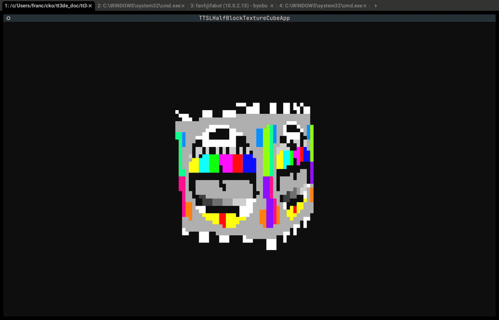

# TinyTiny 3D Engine

A minimalistic 2D/3D engine implemented in Rust and bound to Python, designed to render 3D objects using ASCII art.

It focuses on terminal-friendly rendering experiments while keeping the engine small and hackable.

<p align="center">
  
</p>

<p align="center">
  
</p>

## Features

* **Rendering Primitives**: Supports points, lines, and triangles in both 2D and 3D contexts.
* **ASCII Output**: Renders 3D scenes in a charming ASCII art style.
* **Color Shading Support**: Renders with RGB colors.
* **Materials**: Supports 14 materials, including:
    * **Texture Mapping**: Supports textures up to 256x256 pixels.
    * **Double Raster**: Allows the use of 2 colors per ASCII character (background and foreground).
    * **Perlin Noise**: Basic Perlin noise mapped texture.


## Recommended Terminals :

| Terminal              | Windows                      | macOS                | Linux                |
|-----------------------|------------------------------|----------------------|----------------------|
| [wez Terminal](https://wezterm.org/)          | :star: Fastest rendering accross all terms          |                      |                      |
| [tabby](https://tabby.sh/) | :star: Runs ok, struggle at big resolutions |                      |                      |
| default Windows Terminal | :x: Can't keep up with the rendering |                      |                      |
| VScode terminal       | :x: Does not even works | :x: Can't keep up with rendering | :x:                   |
| [gostty](https://ghostty.org/)                |                               | :star: Perfect! | :star: Perfect, assuming you have your graphics drivers installed |
| [kitty](https://sw.kovidgoyal.net/kitty/)                 |                              | Almost perfect, start to slow down at HighRes | untested       |
| iTerm/iTerm2          |                              | Won't keep up with high refresh rate (>10fps) |                   |


## Setting Up the Development Version

To set up a development version of this engine:

1. Clone this repository:
    ```bash
    git clone <repo_url>
    ```
2. Install uv (if needed):
    ```bash
    pip install uv
    ```
3. Create the environment and install project + dev dependencies:
    ```bash
    uv sync --group dev
    ```
4. Compile the Python extension locally:

    ```bash
    uv run maturin develop --uv --profile release
    ```
5. Check the demo:
    ```bash
    PYTHONPATH=python uv run python demos/3d/some_models.py
    ```

    Browse every ``demos/2d`` and ``demos/3d`` script from one Textual menu:

    ```bash
    uv run python demos/all.py
    ```

6. Run the Python-independent Rust core tests.

    The Cargo workspace separates the reusable engine in
    [`crates/tt3de-core`](crates/tt3de-core/) from the PyO3 extension in
    [`crates/tt3de-py`](crates/tt3de-py/). Core tests therefore need neither a
    Python interpreter nor PyO3 configuration:

    **macOS / Linux (bash/zsh)**:

    ```bash
    bash scripts/cargo_test.sh
    ```

    The helper defaults to `cargo test -p tt3de-core`; pass-through arguments
    go to Cargo (for example `bash scripts/cargo_test.sh --lib`).

    **Windows (PowerShell)**:

    ```powershell
    scripts/cargo_test.ps1
    ```

    Example with Cargo arguments:

    ```powershell
    scripts/cargo_test.ps1 --lib
    ```

    If you are already in PowerShell: `.\scripts\cargo_test.ps1 --lib`.

    The equivalent direct command on every platform is:

    ```bash
    cargo test -p tt3de-core
    ```

    To check every Rust target, including the binding crate, run
    `cargo check --workspace --all-targets`. Build and test the Python surface
    through Maturin and pytest as described in steps 4 and 7.

7. Run the Python unit tests.

Build the extension in develop mode first (step 4); tests import the native `tt3de` module.

Pytest loads packages under `tests/` (for example `from tests.tt3de…`), so keep the **repository root** on `PYTHONPATH`, matching CI’s working directory and [`AGENTS.md`](AGENTS.md).

**macOS / Linux (bash/zsh)**:

```bash
PYTHONPATH=. uv run pytest
```

**Windows (PowerShell)**:

```powershell
$env:PYTHONPATH='.'
uv run pytest
```


8. **Material shading threading benchmark** (`test_bench_material_apply`): 

captures serial vs Rayon (1/2/4/8 threads) over several canvas sizes, writes `benchmarks/material_apply.json`, and prints a compact Rich KPI report (~100-column friendly). From the repository root:

```bash
./scripts/bench_material.sh
```

On Windows PowerShell:

```powershell
.\scripts\bench_material.ps1
```

The report summarizes **speedup vs serial** (`×ser`), **per-thread efficiency** (`η/T`), **scaling loss** vs ideal linear speedup (`loss`), and a **throughput bar** per configuration. Expect roughly one minute on a typical CPU.

Equivalent manual invocation:

```bash
mkdir -p benchmarks
PYTHONPATH=python uv run pytest \
    tests/benchs/r_code/test_bench_r_pix_shader.py::test_bench_material_apply \
    --benchmark-only -q --benchmark-json=benchmarks/material_apply.json
uv run --no-sync python scripts/dev_material_bench_report.py benchmarks/material_apply.json
```

9. Regenerate TTSL opcode/ABI files after opcode definition changes:

```bash
bash scripts/gen_opcodes.sh
```

On Windows PowerShell:

```powershell
powershell -ExecutionPolicy Bypass -File scripts/gen_opcodes.ps1
```

10. **TTSL execution benchmark** (`cargo bench -p tt3de-core --bench all -- ttsl`):

times Cranelift from the post-SSA CFG (`jit` / `jit_cell`) plus one-time compilation. See [`crates/tt3de-core/README.md`](crates/tt3de-core/README.md) for how to read the arms.

Its fixtures are generated from `demos/`, so regenerate them after editing a demo shader or the TTSL compiler:

```bash
make gen-ttsl-bench-fixtures
```

On Windows PowerShell:

```powershell
uv run --no-sync python scripts/gen_ttsl_bench_fixtures.py
```

## Build Documentation

From the repository root, regenerate the Sphinx HTML docs with:

```bash
uv run sphinx-build -b html source source/_build/html
```

For a fully clean rebuild:

```bash
rm -rf source/_build
uv run sphinx-build -b html source source/_build/html
```

On Windows PowerShell, use:

```powershell
Remove-Item -Recurse -Force source\_build
uv run sphinx-build -b html source source/_build/html
```


### Tips for Python Path in VSCode

Due to the mix of Python and Rust in this project, the Python code is located in the `python` folder. More information can be found [here](https://www.maturin.rs/project_layout#mixed-rustpython-project).

In `launch.json` for VSCode:

```json
"env": {"PYTHONPATH": "${workspaceFolder}/python"}
```

In `settings.json`:

```json
{
    "python.analysis.extraPaths": [
        "python"
    ]
}
```

### Known Issues

* Many...
