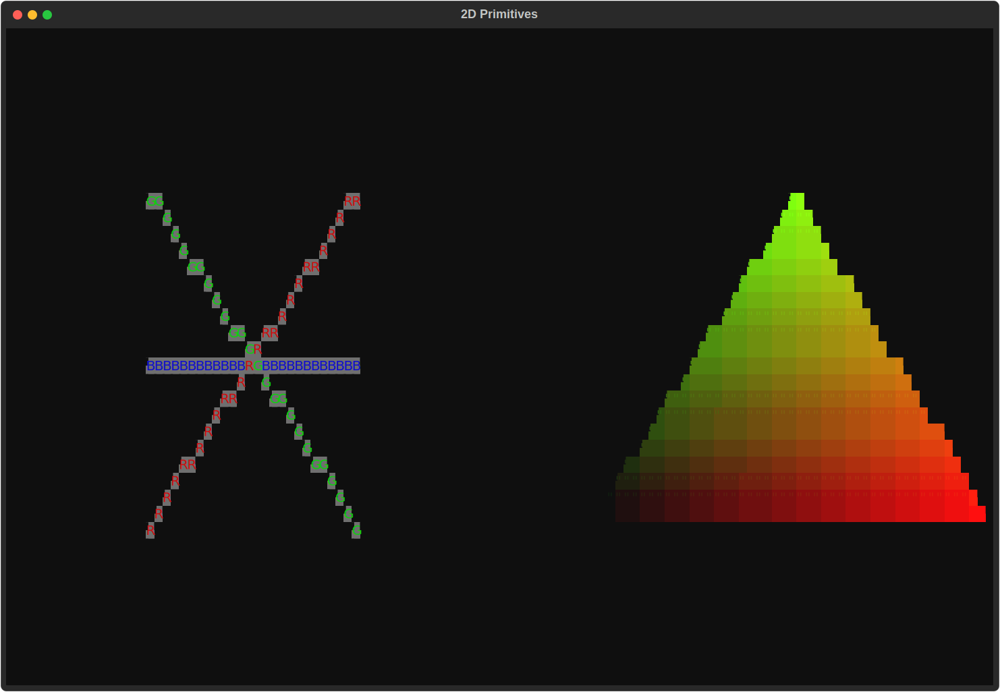
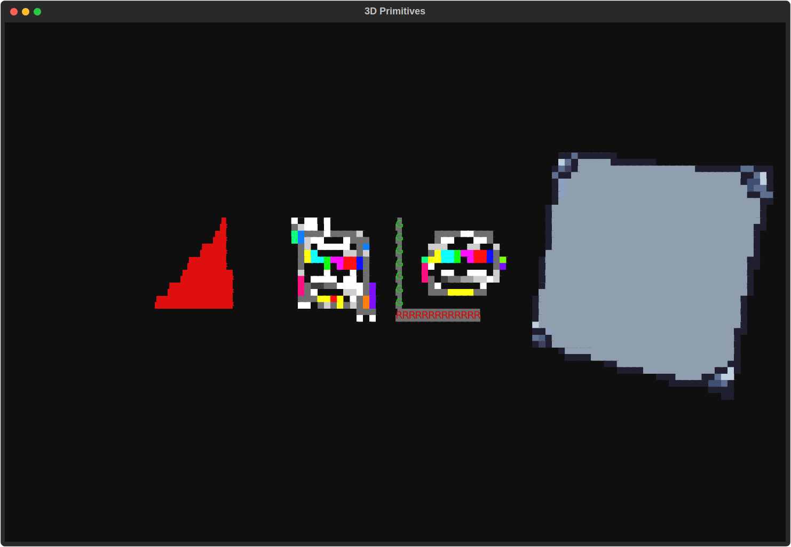

High Level API
==============

This page documents the "day-to-day" Python API used in the demos.
The intended workflow is:

1. create a ``TT3DViewStandAlone`` (or ``TT3DFpsView``) widget
2. initialize materials/textures and build a scene graph
3. append one or more root nodes to the render context
4. animate with ``update_step(delta_time)``
5. embed the view in a Textual ``App``

Minimal app structure
---------------------

.. code-block:: python

    from textual.app import App, ComposeResult
    from textual.widgets import Header
    from tt3de.textual_standalone import TT3DViewStandAlone

    class DemoView(TT3DViewStandAlone):
        def initialize(self):
            pass

        def update_step(self, delta_time: float):
            pass

    class DemoApp(App):
        def compose(self) -> ComposeResult:
            yield Header()
            yield DemoView()

Loading materials
-----------------

Default materials
^^^^^^^^^^^^^^^^^

Most demos start by loading a default texture/material set:

.. code-block:: python

    from tt3de.asset_fastloader import MaterialPerfab

    self.rc.texture_buffer, self.rc.material_buffer = MaterialPerfab.rust_set_0()

Then assign ``material_id`` on each node/mesh.

For transparency layers, see ``source/low_level_api.rst`` (canonical two-pass
model and blend semantics).

Custom materials
^^^^^^^^^^^^^^^^

You can create material entries dynamically via ``material_buffer``:

.. code-block:: python

    from tt3de.tt3de import materials, find_glyph_indices_py

    half_block = find_glyph_indices_py("▀")
    mat_id = self.rc.material_buffer.add_base_texture(
        materials.BaseTexturePy(
            albedo_texture_idx=texture_idx,
            albedo_texture_subid=0,
            glyph_texture_idx=0,
            glyph_texture_subid=0,
            front=True,
            back=True,
            glyph=True,
            glyph_uv_0=True,
            front_uv_0=True,
            back_uv_0=False,
            glyph_method=...,
            blend_mode="alpha_blend",
            glyph_policy="preserve_existing",
        )
    )

To route geometry to the transparent pass, set ``node.transparent = True`` on
``TT2D*`` / ``TT3D*`` primitives before inserting them in the render context.

TTSL ``ShaderPy`` materials
---------------------------

Custom per-pixel shading uses **TTSL** (Python-syntax shaders compiled to bytecode)
and ``materials.ShaderPy``, which the renderer runs like any other material. See
:doc:`ttsl` for builtins and uniforms; :doc:`ttsl_compiler` covers compilation and
register wiring in depth.

Typical flow:

1. Put shader source in a string and call ``all_passes_compilation(...)`` once.
2. Keep **material slot 0** as a plain static fill (sentinel / cleared depth uses
   ``material_id=0``; putting ``ShaderPy`` there would shade the whole canvas).
3. Build ``ShaderPy`` with the bytecode, ``register_seed=reg_settings.get_register_list()``,
   and optional ``*_reg`` fields for engine uniforms (for example ``time_f32_reg`` when the
   shader reads ``tt_Time``).
4. ``add_shader(...)`` returns a material id; assign it on 2D nodes or 3D meshes.

.. code-block:: python

    from tt3de.tt3de import find_glyph_indices_py, materials
    from tt3de.ttsl.compiler import GLOBAL_VAR_TT_TIME, all_passes_compilation

    SHADER_SRC = """
    def my_shader(tt_TexCoord0: vec2) -> tuple[vec4, vec4, int]:
        rgb = vec4(tt_TexCoord0.x, tt_TexCoord0.y, 0.5 + 0.5 * glm.sin(tt_Time), 1.0)
        return (rgb, rgb, 0)
    """

    bytecode, reg_settings = all_passes_compilation(
        SHADER_SRC, "my_shader", {GLOBAL_VAR_TT_TIME: float}
    )
    _, time_reg = reg_settings.var_name_to_registers[GLOBAL_VAR_TT_TIME]

    self.rc.material_buffer.add_static(
        (0, 0, 0), (0, 0, 0), find_glyph_indices_py(" ")
    )
    shader_mat = materials.ShaderPy(
        bytecode,
        time_f32_reg=time_reg,
        default_glyph=find_glyph_indices_py("█"),
        register_seed=reg_settings.get_register_list(),
    )
    shader_mat_id = self.rc.material_buffer.add_shader(shader_mat)
    # … attach shader_mat_id on TT2DUnitSquare(..., material_id=shader_mat_id), etc.

Engine uniforms such as ``tt_Time`` update without recompiling via
``MaterialBufferPy`` helpers — for example in ``before_render_step``:

.. code-block:: python

    def before_render_step(self) -> None:
        self.rc.material_buffer.set_shader_time(
            shader_mat_id, float(self.time_since_start())
        )

Working references: ``demos/2d/ttsl_square.py``, ``demos/3d/ttsl_texture_cube.py``,
``demos/3d/ttsl_fog.py``, and the compiler playground ``demos/ttsl.py``.

2D world
--------

   Points, lines, a triangle polygon, and unit squares with different materials
   (:source:`source <scripts/screenshot_apps/primitives_2d.py>`).

Core classes
^^^^^^^^^^^^

- ``TT2DNode``: scene graph container node
- ``TT2DPoints``: points
- ``TT2DLines``: line segments
- ``TT2DPolygon``: polygon mesh + triangle index list
- ``TT2DUnitSquare``: utility quad primitive

Adding points and lines
^^^^^^^^^^^^^^^^^^^^^^^

.. code-block:: python

    from tt3de.points import Point3D
    from tt3de.textual_standalone import TT3DViewStandAlone
    from tt3de.tt_2dnodes import TT2DNode, TT2DPoints, TT2DLines

    class PointsAndLinesView(TT3DViewStandAlone):
        def initialize(self) -> None:
            root = TT2DNode()
            root.add_child(TT2DPoints(point_list=[Point3D(0.0, 0.0, 0.0)], material_id=1))
            root.add_child(
                TT2DLines(
                    point_list=[Point3D(-0.5, -0.5, 0.0), Point3D(0.5, 0.5, 0.0)],
                    material_id=2,
                )
            )
            self.rc.append_root(root)

Adding polygons
^^^^^^^^^^^^^^^

``TT2DPolygon`` expects vertices, triangle indices, and optionally UVs.

.. code-block:: python

    from tt3de.points import Point2D, Point3D
    from tt3de.textual_standalone import TT3DViewStandAlone
    from tt3de.tt_2dnodes import TT2DNode, TT2DPolygon

    class TexturedTriangleView(TT3DViewStandAlone):
        def initialize(self) -> None:
            poly = TT2DPolygon(
                point_list=[
                    Point3D(-0.5, -0.5, 0.0),
                    Point3D(0.0, 0.5, 0.0),
                    Point3D(0.5, -0.5, 0.0),
                ],
                triangles=[(0, 1, 2)],
                uvmap=[(Point2D(0.0, 0.0), Point2D(0.5, 1.0), Point2D(1.0, 0.0))],
                material_id=7,
            )
            root = TT2DNode()
            root.add_child(poly)
            self.rc.append_root(root)

Animating 2D nodes
^^^^^^^^^^^^^^^^^^

Use ``update_step`` on the same view class to update transforms or materials each frame.

.. code-block:: python

    from pyglm import glm

    from tt3de.textual_standalone import TT3DViewStandAlone

    class OrbitingGlyphView(TT3DViewStandAlone):
        def initialize(self) -> None:
            # Build self.some_node (for example a TT2DUnitSquare) and append its root here.
            ...

        def update_step(self, delta_time: float) -> None:
            t = self.time_since_start()
            x = glm.sin(t)
            y = glm.cos(t)
            self.some_node.set_local_transform(glm.translate(glm.vec3(x, y, 0.0)))

3D world
--------

   Prefab triangle, square, circle, axis gizmo, and a loaded OBJ cube
   (:source:`source <scripts/screenshot_apps/primitives_3d.py>`).

Core classes
^^^^^^^^^^^^

- ``TT3DNode``: 3D scene graph container
- ``Prefab3D``: helper constructors for test geometry (triangle, square, gizmos, circle, cube, lat-long sphere)
- ``fast_load(...)``: loads meshes/textures from files

Adding primitive meshes
^^^^^^^^^^^^^^^^^^^^^^^

.. code-block:: python

    from pyglm import glm

    from tt3de.prefab3d import Prefab3D
    from tt3de.textual_standalone import TT3DViewStandAlone
    from tt3de.tt_3dnodes import TT3DNode

    class ElevatedTriangleView(TT3DViewStandAlone):
        def initialize(self) -> None:
            root = TT3DNode()
            tri = Prefab3D.unitary_triangle()
            tri.material_id = 6
            tri.local_transform = glm.translate(glm.vec3(0.0, 1.0, 0.0))
            root.add_child(tri)
            self.rc.append_root(root)

Lat-long UV sphere
^^^^^^^^^^^^^^^^^^

``Prefab3D.latlong_uv_sphere(radius=1.0, stacks=4, slices=10)`` returns a
faceted (flat-shaded) ``TT3DPolygon`` with a latitude–longitude tessellation
and per-triangle UVs in [0, 1].  Y-up, poles on ±Y.  Useful for ``tt_Normal``
lighting demos where per-face normals are expected.

.. code-block:: python

    from tt3de.prefab3d import Prefab3D

    sphere = Prefab3D.latlong_uv_sphere(0.5, stacks=6, slices=12)
    sphere.material_id = shader_mat_id
    root.add_child(sphere)

Loading models
^^^^^^^^^^^^^^

.. code-block:: python

    from tt3de.asset_fastloader import fast_load
    from tt3de.textual_standalone import TT3DViewStandAlone
    from tt3de.tt_3dnodes import TT3DNode

    class ObjCubeRootView(TT3DViewStandAlone):
        def initialize(self) -> None:
            self.root3Dnode = TT3DNode()
            mesh = fast_load("models/cube.obj", reverse_uv_v=False, flip_triangles=True)
            mesh.material_id = 11
            self.root3Dnode.add_child(mesh)
            self.rc.append_root(self.root3Dnode)

Animating 3D nodes
^^^^^^^^^^^^^^^^^^

.. code-block:: python

    from pyglm import glm

    from tt3de.textual_standalone import TT3DViewStandAlone

    class SpinningCubeView(TT3DViewStandAlone):
        def initialize(self) -> None:
            # Load or build self.cube and append a 3D root in this method.
            ...

        def update_step(self, delta_time: float) -> None:
            self.cube.apply_transform(glm.rotate(delta_time, glm.vec3(0, 1, 0)))

Camera, debug view, and events
------------------------------

- ``DebuggedView(...)`` wraps a view and displays useful debug state.
- ``TT3DFpsView`` provides FPS-like navigation behavior.
- You can override ``on_event`` in your view for keyboard/mouse interactions.

Recommended reading order
-------------------------

1. ``demos/2d/standalone.py`` (smallest setup)
2. ``demos/2d/material_test.py`` (materials and geometry variety)
3. ``demos/2d/ttsl_square.py`` (compiled TTSL + ``ShaderPy`` on a quad)
4. ``demos/3d/triangle_test.py`` (basic 3D primitives)
5. ``demos/3d/some_models.py`` (assets, texture materials, interaction)
